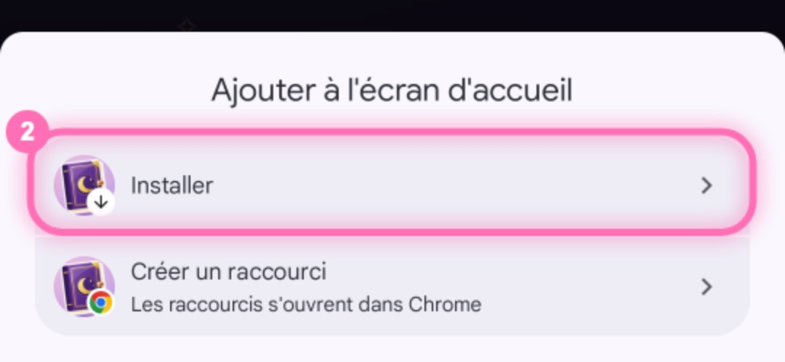

<h1 align="center">Mon grimoire de lectures</h1>

Une appli de lectures perso, cosy et fantasy, entièrement en français. 
<b><a href="https://alinemasson.github.io/grimoire/">alinemasson.github.io/grimoire</a></b> · <a href="https://alinemasson.github.io/grimoire/aide.html">mode d'emploi</a>

---

## Ce qu'on y trouve

- **Mes livres** : ajout par scan du code-barres, par recherche du titre ou à la main ; lectures, pages lues, minuteur de lecture, achats.
- **Étagère magique** : les livres rangés par année sur un meuble en bois, en tranches ou en couvertures, avec des décorations à gagner. Le hibou apporte un livre de la pile à lire.
- **Carnet** : critères, humeurs et tropes pour chaque livre ; citations avec photo et lecture du texte de la photo.
- **Stats et bilan** : rythme, temps de lecture, goûts, l'année en chiffres, les Grimoires d'or et le bilan en stories.
- **Quêtes** : niveaux de sorcière, défis de la semaine, bingo, sceaux en cire, cartes de collection, quêtes de saison et pari du destin, avec des animations à chaque victoire.
- **Thèmes au fil de l'année** : saisons, fêtes, pleine lune…

## Installer

Le grimoire s'installe depuis le navigateur, sans store.

**Android (Chrome)** : ouvre [alinemasson.github.io/grimoire](https://alinemasson.github.io/grimoire/) → menu **⋮** → **Ajouter à l'écran d'accueil** → **Installer** (pas « Créer un raccourci ») → **Installer**.

**iPhone (Safari)** : ouvre l'adresse → bouton **Partager** → **Sur l'écran d'accueil** → **Ajouter**. L'appli n'a pas encore été testée sur iPhone : le scan des codes-barres n'y marche pas (on tape l'ISBN).

Le pas à pas complet, avec les captures, est dans le **[mode d'emploi](https://alinemasson.github.io/grimoire/aide.html)**.

## Mises à jour

- **Automatiques** : quand une nouvelle version est en ligne, l'appli se recharge en revenant dedans, ou affiche « Nouvelle version : toucher pour l'avoir ».
- **Vérifier** : la version est écrite tout en bas de ⚙️ Réglages.
- **Bloquée sur une ancienne version** : ⚙️ Réglages → **Réparer**, ou la page [reparer.html](https://alinemasson.github.io/grimoire/reparer.html). Elle efface la copie de l'appli gardée par le téléphone, sans toucher aux livres, au carnet ni aux réglages.

## Les données

- Tout est enregistré **sur le téléphone**, dans le stockage de l'appli. Rien n'est envoyé sur ce site.
- **Sauvegarde** : un fichier `.zip` à exporter depuis ⚙️ Réglages, ou une sauvegarde automatique dans son Google Drive avec un code de liaison personnel.
- L'appli va chercher en ligne les informations et les couvertures des livres (Google Books, Open Library).

## Ce dépôt

Il contient l'appli publiée sur GitHub Pages :

| Fichier | Rôle |
|---|---|
| `index.html` | l'appli entière, en une page (assemblée à partir de sources modulaires qui ne sont pas dans ce dépôt) |
| `sw.js` | service worker : fonctionnement hors connexion, mises à jour, réception des fichiers partagés |
| `manifest.webmanifest`, `icone2-*.png` | installation sur l'écran d'accueil et icônes |
| `version.txt` | numéro de la version en ligne, comparé par l'appli pour se mettre à jour |
| `aide.html`, `aide/` | le mode d'emploi et ses captures |
| `reparer.html` | la page de réparation d'une mise à jour bloquée |

## Crédits

- Décorations : [Noto Emoji](https://github.com/googlefonts/noto-emoji) et [Noto Emoji Animation](https://googlefonts.github.io/noto-emoji-animation/) © Google (CC BY 4.0), [Fluent Emoji](https://github.com/microsoft/fluentui-emoji) © Microsoft (MIT), animations de Microsoft Teams via [Animated Fluent Emojis](https://github.com/Tarikul-Islam-Anik/Animated-Fluent-Emojis) (usage personnel, droits réservés à Microsoft ; affichées par lien, pas copiées ici).
- Icônes de l'interface : [Lucide](https://lucide.dev) (ISC).
- Bibliothèques : [sql.js](https://github.com/sql-js/sql.js), [JSZip](https://stuk.github.io/jszip/), [Tesseract.js](https://tesseract.projectnaptha.com/) pour la lecture du texte des photos.
